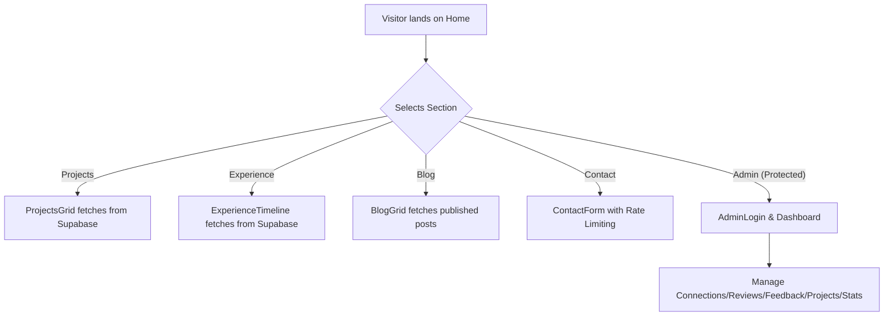
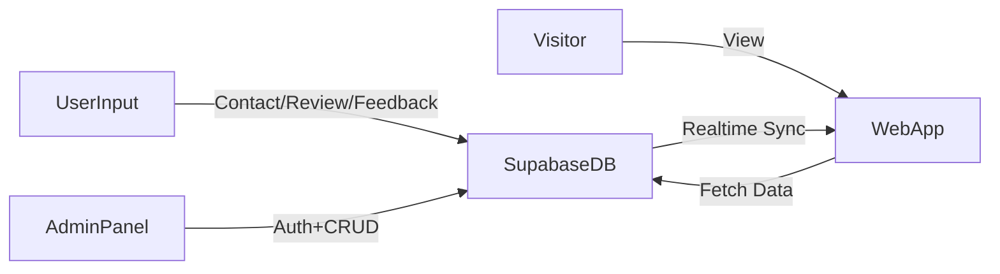

# 📃Portfolio

Welcome to my dynamic portfolio web application! 🚀  
This project showcases my expertise as a Full-Stack Developer and AI Enthusiast, featuring modern web technologies, interactive components, and a fully integrated admin dashboard.

---

## 🌟 Highlights

- **Dynamic Content:** All portfolio data (projects, experiences, certifications, testimonials, etc.) is fetched from a live Supabase backend. Admin updates appear instantly.
- **Modern Stack:** Built with [Next.js](https://nextjs.org/), [React](https://react.dev/), [Supabase](https://supabase.com/), [Tailwind CSS](https://tailwindcss.com/), and [Framer Motion](https://www.framer.com/motion/).
- **Admin Dashboard:** Secure, rate-limited, and session-based admin panel for content management (connections, feedback, reviews, projects, stats).
- **Rich Animations:** Smooth UI/UX with Framer Motion.
- **SEO & Analytics:** Structured data, Open Graph, and portfolio performance tracking.
- **Modular Design:** All sections (Projects, Experience, Education, Testimonials, Toolbox, Blog, etc.) are modular and scalable.

---

## 🖥️ Preview


> _Home, Projects, and Experience sections with live data and engaging UI._

---

## 📊 Application Flow



---

## 📈 Data Flow & Admin Overview



---

## 🚦 Getting Started

### 1. Clone & Install

```bash
git clone https://github.com/Harshit16g/Portfolio.git
cd Portfolio
npm install
```

### 2. Setup Environment

Create a `.env.local` file:

```env
NEXT_PUBLIC_SUPABASE_URL=your_supabase_url
NEXT_PUBLIC_SUPABASE_ANON_KEY=your_supabase_anon_key
SUPABASE_SERVICE_ROLE_KEY=your_service_role_key
```

### 3. Run Locally

```bash
npm run dev
```

---

## 🔒 Admin Access

- Go to `/admin`
- Enter the protected password (set in your backend/API route)
- Admin features: View/manage connections, reviews, feedback, projects, experience, and stats.  
  Rate-limited and session-protected for security.

---

## 🧩 Main Features

- **Home:** Hero, featured projects, tech stack, connect section.
- **Projects:** All portfolio projects with tags, live/demo/code links.
- **Experience:** Timeline of professional roles (with technologies).
- **Certifications & Education:** Academic & professional achievements.
- **Testimonials:** Client & peer reviews, live approval via admin.
- **Blog:** Dynamic blog posts with tags and reading time.
- **Contact:** Rate-limited contact form, quick info, social links.
- **Stats:** Live portfolio metrics and growth rate.

---

## 🛠️ Technologies Used

- **Frontend:** Next.js, React, TypeScript, Tailwind CSS, Framer Motion, Lucide Icons
- **Backend:** Supabase (Postgres + Auth + Realtime)
- **Admin:** Custom panel, session & rate limiting, secure API endpoints

---

## 📂 Directory Structure

```
app/
  ├── about/
  ├── admin/
  ├── blog/
  ├── certifications/
  ├── contact/
  ├── education/
  ├── experience/
  ├── projects/
  ├── stats/
  ├── testimonials/
  ├── toolbox/
components/
lib/
hooks/
```

---

## 🤝 Contributing

Pull requests are welcome for bug fixes, improvements, and new features.  
For major changes, please open an issue first.

---

## 📬 Contact

- Email: harshitlodhi220593@acropolis.in
- [GitHub](https://github.com/harshit16g)
- [LinkedIn](https://www.linkedin.com/in/harshit-lodhi-5575b8314)

---

## ⭐️ Star this repo if you like it!

---

